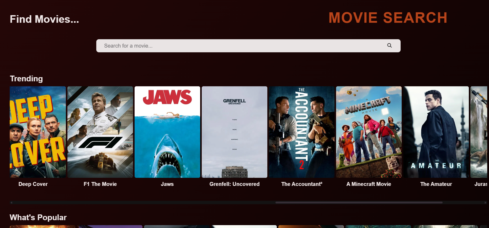
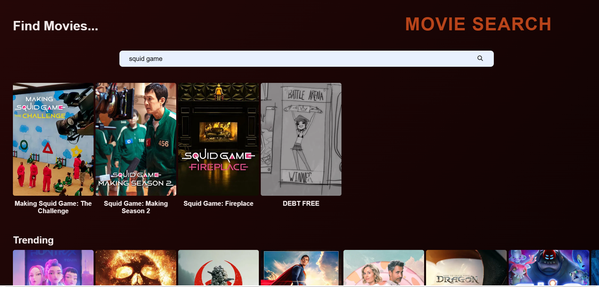
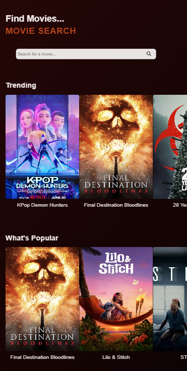
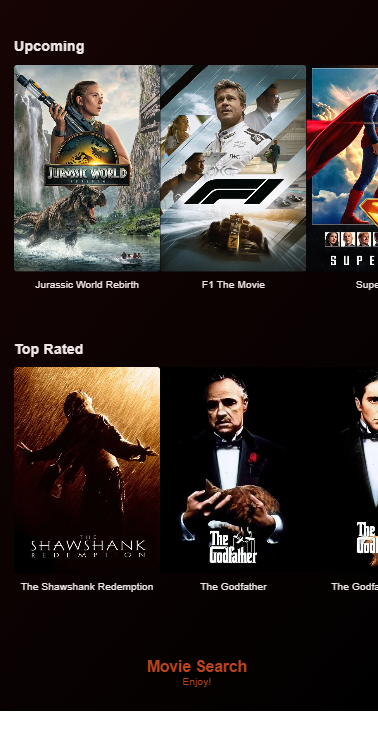

# Movie Search App

This is a movie search app that has interactive and responsive design. Fetching movie data by the TMDB API. Users can explore trending, popular, upcoming, and top-rated movies, search for a specific movie, and watch trailer movies from YouTube.

## Features
 
* Search for specific and related movie results
* View trending, popular, upcoming, and top-rated categories
* Modal popup for viewing poster, rating, language, and overview details of movies
* Responsive layout as desktop and mobile devices
* Movie categories align horizontally
* Watch movie trailer via YouTube by web link
* Reusable functions for maintainable and cleaner code

## What I learned

The project is part of my learning web development.

* Working with API (TMDB) 
* Fetching requests data 
* Creating reuseable cards and modals 
* Making responsive layout design by css
* Handling async/await functions
* Handling error by failed fetches and invalid data responses
* Dom Manipulation

## How to Use

1. Clone this repository
   
```bash
git clone https://github.com/m-lilyy/Movie-Search.git
cd Movie-Search

3. Go to [TMDB](https://developer.themoviedb.org/reference/intro/getting-started) and get an API key if don't have
4. Create a config.js file and add as following:
   
  const config = {
  apiKey: "YOUR_API_KEY"
};

## Tech Stack

* HTML5
* CSS3
* JavaScript (Vanilla)
* Google Font
* Font Awesome
* TMDB API


## Screenshots






## License

MIT License
